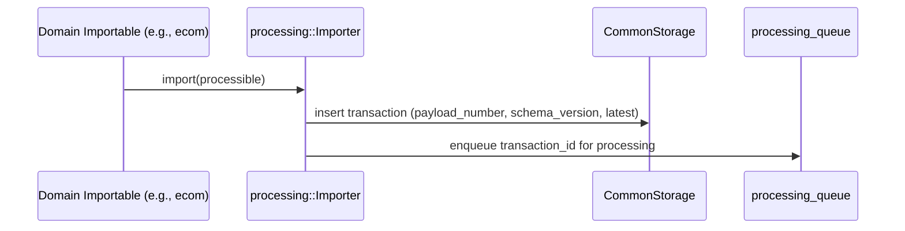
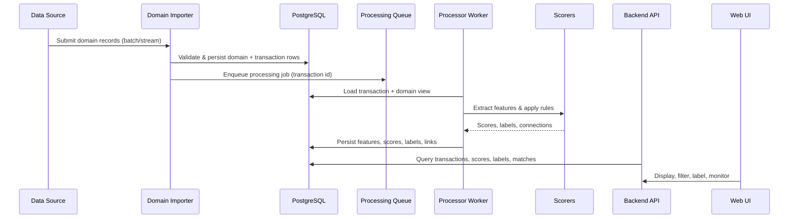

# Frida-AI Architecture

Frida-AI is a model-agnostic fraud detection and risk analysis platform. It ingests transactional data, extracts features, scores risk, and exposes results through an API and web UI. Domain-specific logic (e.g., e-commerce) plugs into a core processing engine via traits and clearly separated crates.

## High-Level Components

- `processing/`: Core, model-agnostic engine (traits, queue, processor, scoring, storage abstractions, GraphQL helpers).
- Domain crates: `ecom/`, `ecom-f2/` implement required traits and ship binaries (`backend`, `importer`, `processor`) using the core engine.
- `common/`: Shared utilities (config, test helpers).
- `migrations/`: Core schema for processing (run with processing-only tests/binaries).
- `web/`: React + Vite UI consuming the backend GraphQL/REST surface.
- Ops & tooling: `config/` base YAMLs, env-specific overrides, `docker-compose.yml`, `grafana/`, `prometheus/`, `aux/` sample data.

## Component Topology

```mermaid
graph TD
  subgraph Core["Core (processing)"]
    P[Processor]
    Q[Queue]
    S[Scorers]
    G[GraphQL/API helpers]
    ST[(Storage abstractions)]
  end

  subgraph Domains["Domain Modules"]
    Ecom[[ecom]]
    EcomF2[[ecom-f2]]
  end

  subgraph Services["Executables"]
    BE[Backend API]
    IMP[Importer]
    PROC[Processor Worker]
  end

  DB[(PostgreSQL)]
  UI[Web (React/Vite)]
  Obs[Prometheus/Grafana]

  Domains -->|implements traits| Core
  Core -->|linked into| Services
  IMP -->|validate + insert domain data| DB
  IMP -->|enqueue jobs| Q
  PROC -->|dequeue + enrich + score| DB
  BE -->|read/write via storage| DB
  UI --> BE
  Obs --> BE
  Obs --> PROC
```

## Processing Engine Deep Dive (`processing/`)

- Model-agnostic: traits for `Processible`, `Importable`, `WebTransaction`, storage, queue, and scoring; no domain imports.
- Queues: `processing_queue` for new items; `recalculation_queue` for neighbors impacted by matches (pgmq/Postgres-backed).
- Storage: `MongoCommonStorage` (current impl) persists transactions, features, scores, and matching graph structures; interchangeable behind `CommonStorage`.
- Scoring: `Scorer` trait enables pluggable models (rule-based, ML, hybrid); default `ExpressionBasedScorer` evaluates expressions over features.

### Import Flow



- Domain crate constructs the processible payload; core importer handles persistence + enqueue.
- Transactions are versioned per `payload_number`; latest flagged; labels/comments carried forward.

### Processing Flow (new transaction)

```mermaid
sequenceDiagram
  participant Queue as processing_queue
  participant Processor as processing::Processor
  participant Storage as CommonStorage
  participant Matcher as Matching/Graph
  participant Scorer as Scorer impl

  Queue ->> Processor: fetch transaction_id
  Processor ->> Storage: load transaction payload
  Processor ->> Processible: extract matching_fields
  Processor ->> Storage: save matching fields
  Processor ->> Matcher: fetch connected + direct transactions (graph traversal)
  Processor ->> Processible: extract simple_features
  Processor ->> Processible: extract graph_features(connected, direct)
  Processor ->> Storage: save features
  Processor ->> Scorer: score(simple_features, graph_features)
  Scorer -->> Processor: triggered rules / outputs
  Processor ->> Storage: save scores; mark processed
  Processor ->> recalculation_queue: enqueue matched neighbors
```

- Matching/graph traversal is bounded (depth/limit/min_confidence) and configurable via matcher configs.
- Metrics capture per-stage timings and processed counts.

### Recalculation Flow (neighbor update)

```mermaid
sequenceDiagram
  participant Queue as recalculation_queue
  participant Processor as processing::Processor
  participant Storage as CommonStorage
  participant Matcher as Matching/Graph
  participant Scorer as Scorer impl

  Queue ->> Processor: fetch transaction_id
  Processor ->> Storage: load transaction (simple_features already stored)
  Processor ->> Matcher: fetch connected + direct transactions
  Processor ->> Processible: extract graph_features(connected, direct)
  Processor ->> Storage: save graph_features (simple unchanged)
  Processor ->> Scorer: score(simple_features, graph_features)
  Processor ->> Storage: save scores; record metrics
```

- Only graph-dependent features recomputed; simple features reused.
- Same scoring pathway; ensures neighbors stay consistent when graph changes.

### Matching & Graph Traversal

- `matching_fields` persisted per transaction; used to find connections (shared identifiers, devices, emails, IPs).
- Connected transactions (`find_connected_transactions`) support configurable depth/limit/confidence; direct connections capture explicit joins.
- These neighborhoods power `extract_graph_features`, enabling network-aware risk signals.

### Feature Extraction

- `extract_simple_features`: local transaction signals.
- `extract_graph_features`: context-aware signals derived from connected/direct neighbors.
- Features saved together; recalculation updates graph portion while keeping simple intact.

### Scoring Model Flexibility

- `Scorer` trait abstracts scoring; implementations choose rule engines or ML.
- `ExpressionBasedScorer` (default) builds an expression context from all features and evaluates configured rules.
- Activations stored in DB enable swapping/stacking models without changing processor/importer code.

## Runtime Data Flow



## Deployment Model

- Binaries per domain: `backend`, `importer`, `processor` under `ecom/` and `ecom-f2/`, each embedding the core `processing` crate.
- Docker Compose and YAML configs provide service wiring; prometheus + grafana ship dashboards and scrapes.
- Single-DB stance: PostgreSQL stores core transactions, features, scores, labels; domains may add their own tables but core stays schema-agnostic.

## Domain Boundaries & Rules

- Core (`processing/`) **must remain model-agnostic**: no imports from domain crates; no domain entities in core storage or traits.
- Domains depend on core; never the reverse. Shared code belongs in `common/` when needed to avoid cycles.
- Core schema must not foreign-key to domain tables. Domains may reference core transaction IDs (nullable FK or join table) when running a single-domain binary.
- New model types implement: `Processible`, `Importable`, `WebTransaction`, `ModelRegistryProvider`; supply storage impls and migrations in their crate.

## Storage & Queue

- Database: PostgreSQL (SQLx) for transactions, features, labels, scores, matching metadata.
- Queue: async processing queue within `processing::queue` consumed by processor workers; jobs typically enqueued by importers or API-triggered rescoring.
- GraphQL: helpers under `processing/src/graphql/` expose filters, inputs, and types consumed by backend binaries.

## Observability & Ops

- Prometheus configs under `prometheus/`; Grafana dashboards under `grafana/`.
- Config layering: `config/base.yaml` with environment overrides (e.g., `config/dev.yaml`, domain-specific configs under each domain crate).
- Sample data: `aux/frida_sample_data.sql`; scripts under `examples/`.

## Extensibility Checklist (new domain)

1. Create a new crate alongside `ecom/`.
2. Define domain entities and migrations (domain-owned tables only).
3. Implement required processing traits and storage adapters.
4. Provide binaries (backend/importer/processor) wiring your implementations.
5. Add config files; update compose/manifests if deploying.
6. Add UI support in `web/` if the domain needs bespoke views.

## Key Repos & Paths

- Core engine: `processing/`
- Domain implementations: `ecom/`, `ecom-f2/`
- Frontend: `web/`
- Config: `config/`, plus domain `config/` directories
- Migrations: `migrations/` (core)
- Observability: `prometheus/`, `grafana/`
- Tooling & samples: `aux/`, `examples/`

